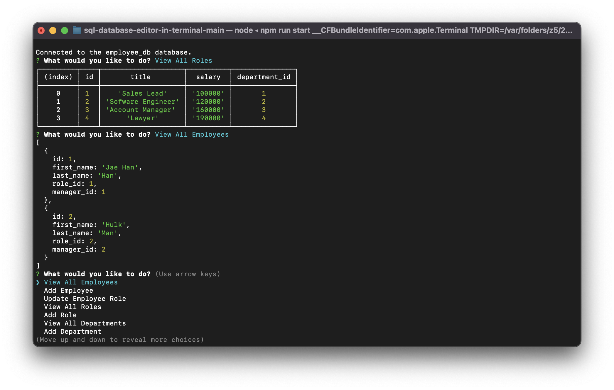

# SQL Database Manager - Employees
### Table of Contents
1. [Description](#description)
2. [Installation Instructions](#installation)
3. [Usage Information](#usage)
4. [Credits](#credits)
5. [Contact](#contact)
## Description 
The SQL Database Manager is a NodeJS program that runs in the terminal to update a remote SQL database that stores employee information. The user can perform the following tasks:\n*View all employees\n*Add an employee\n*Update an employee's role\n*View all roles\n*Add a role\n*View all departments\n*Add a department
## Installation Instructions 
Download the project directory and install the necessary dependencies with `npm i` from the root directory. Run `npm run start` to start the program once the SQL database is initialized.
## Usage Information

## Credits
UCLA Extension, Jaewoo Han
## Contact 
Github: [@jhan213](https://github.com/jhan213)

Email: [jhan213840@gmail.com](mailto:jhan213840@gmail.com)
